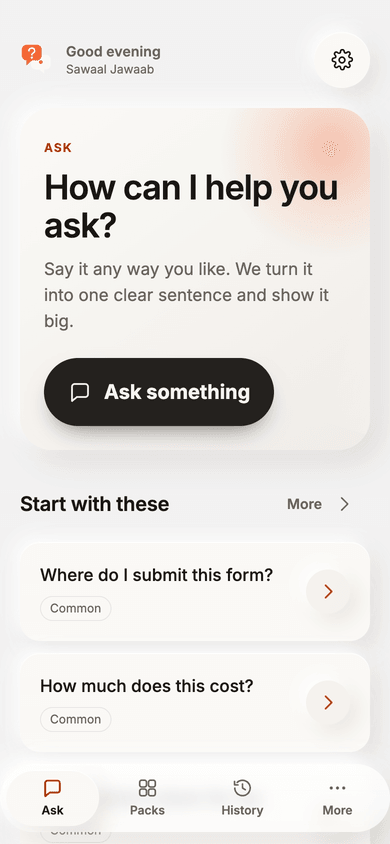
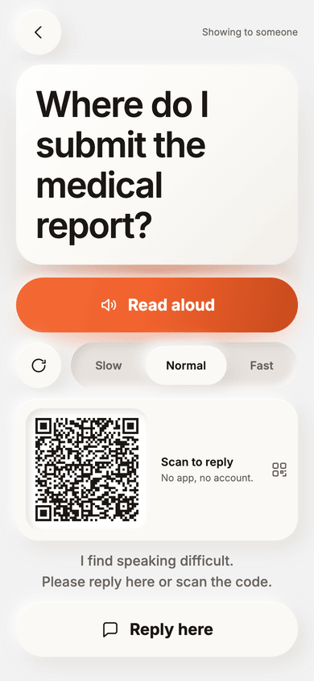
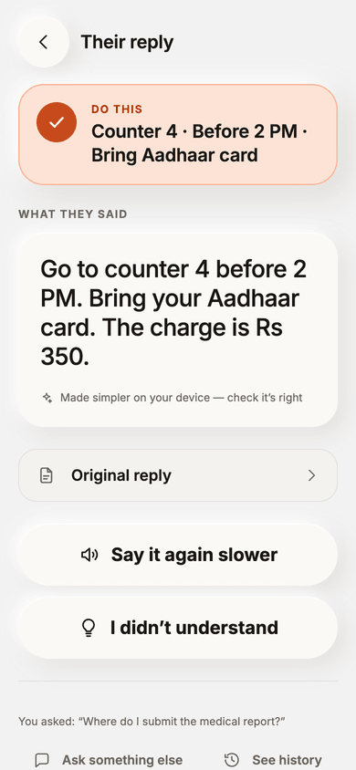
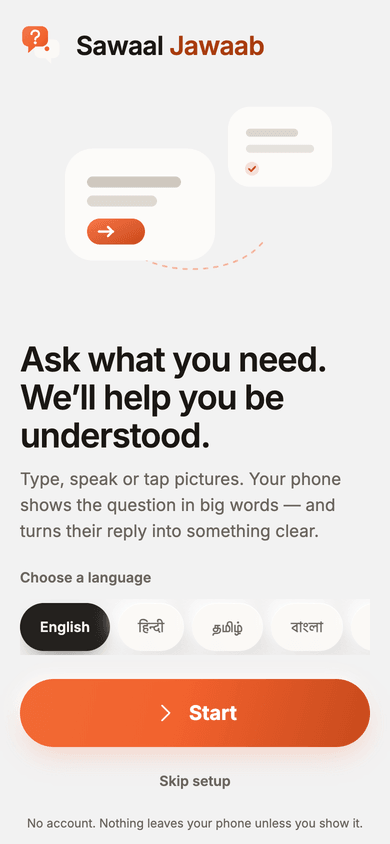
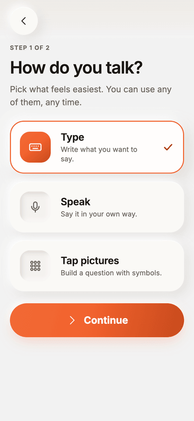
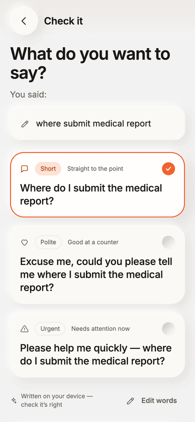
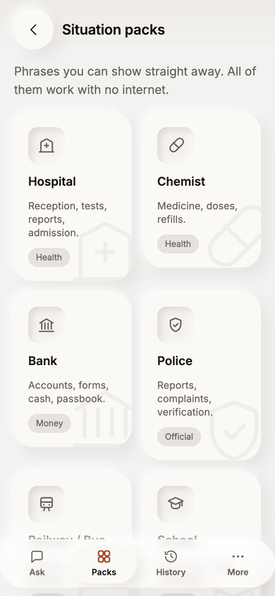
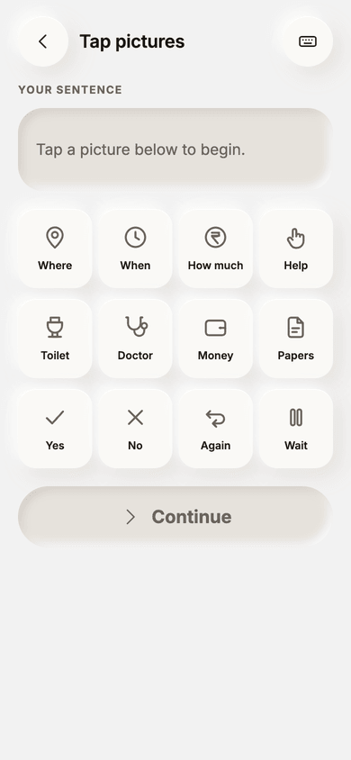
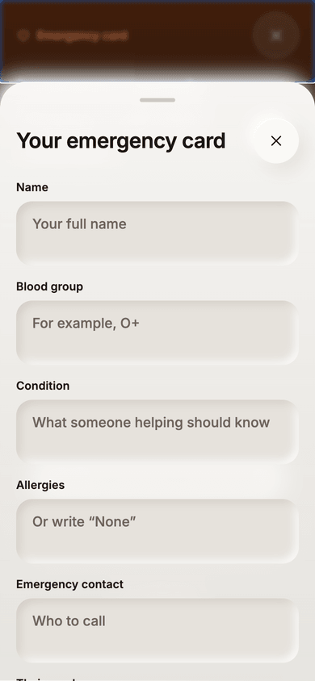
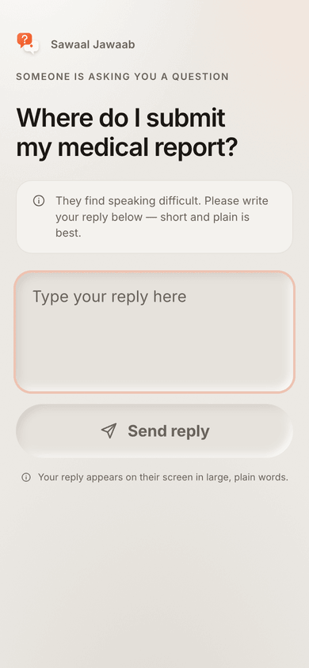

# Sawaal Jawaab

**When speaking is difficult, communication shouldn't stop.**

A communication aid for the moment someone has to ask a stranger something — at
a hospital counter, a bank, a ticket window — and speaking is hard.

The whole product is one journey:

```
ASK  →  POLISH  →  SHOW  →  UNDERSTAND
```

Ask it any way you like. It becomes one clear sentence. Your phone turns into a
card the other person can read. Their reply comes back in plain words, with the
one thing you have to do next at the top.


<p align="center">
  
  
  
</p>

<p align="center"><em>Ask it roughly · show it big · get the answer back in plain words</em></p>

---

## Two surfaces, and why both

```
26_SawaalJawaab/
  mobile/      the app        — Expo · expo-router · Reanimated
  frontend/    the web page   — Vite · React · TypeScript
  supabase/    the migration that carries a reply back
```

**`mobile/` is the app** the person who finds speaking difficult installs.

**`frontend/` is not a leftover.** It is the page the QR code opens. Someone at
a hospital counter cannot install an app in order to reply to you, so the reply
and family-helper views have to be a plain web page that works in seconds with
no account. It doubles as the browser demo.

| | |
| --- | --- |
| Reply page (what the QR opens) | https://prayanshsingh0007.github.io/Sawaal-Jawaab/ |
| Database | Supabase `Sawaal Jawaab` · ap-south-1 |

The page redeploys from `main` on every push.

---

## Running it

**The app, on your phone**

```bash
cd mobile && npm install && npx expo start
```

Scan the terminal QR with **Expo Go**. Phone and laptop on the same Wi-Fi.

**An installable APK**

```bash
cd mobile
npx eas login     # your Expo account
npx eas init      # writes the project id into app.json
npx eas build -p android --profile preview
```

Builds in the cloud — no Android Studio, no Java, nothing installed locally.
Returns a download link. Credentials are already in `eas.json`.

iOS is configured too, but the `preview` profile builds for the **simulator**
(needs Xcode), and a build that runs on a real iPhone needs a paid Apple
Developer account.

**The web page**

```bash
cd frontend && npm install && npm run dev
```

None of these need an API key or a login. The core journey works offline.

---

## The demo, in 90 seconds

1. Type something rough — `where submit medical report`.
2. **Continue** → three versions appear, written on-device.
3. Pick one → **Show this**. The phone becomes the card.
4. Scan the code with any other phone. The question opens in a browser — no app,
   no account, no install.
5. Type a reply there and send it. **The asker's phone moves to the answer on
   its own**, with the one thing to do at the top:
   `Counter 4 · Before 2 PM · Bring Aadhaar card`.
6. Turn off Wi-Fi and repeat steps 1–3. Everything still works.

Worth saying out loud: **the question never reaches the server.** It travels
inside the QR link and nowhere else.

---

---

## Every screen

| | | |
| --- | --- | --- |
|  |  |  |
| **Welcome** — a door, not a landing page | **How do you talk** — type, speak, or tap pictures | **Polish** — short, polite or urgent, and honest about where the words came from |
|  |  |  |
| **Packs** — 120 phrases for the places people actually go, all offline | **Pictures** — build a question without writing a word | **Emergency card** — maximum contrast, no red. Help, not danger |
|  | | |
| **What the stranger sees** — a plain web page, no app, no account | | |


## The one rule that shaped the engineering

**The Show screen never waits.**

The question is on screen the moment the person arrives — rendered from their
own raw text, with a real QR code generated on-device. AI, where it is
available, improves the sentence *before* that point; it never blocks it. There
is no spinner on the most important screen in the app.

Everything else follows from the same idea:

| If this is unavailable | This still works |
| --- | --- |
| Internet, or any AI | The on-device engine writes all three versions |
| Speech synthesis | The big text and the QR code |
| Microphone | Typing and the symbol board |
| Supabase | Handing the phone over and tapping **Reply here** |
| Local storage | The current question, the packs, the emergency card |

---

## What the two surfaces share

The whole decision-making core is platform-agnostic TypeScript and is the same
file on both sides — the offline sentence engine, the reply simplifier, the
prompts, the 120 phrases, the symbols and every type. Only the edges differ:

| | `frontend/` | `mobile/` |
| --- | --- | --- |
| Storage | IndexedDB | AsyncStorage |
| Reading aloud | `speechSynthesis` | `expo-speech` |
| Dictation | Web Speech API | needs a dev build; degrades to typing |
| QR | `qrcode.react` | `react-native-qrcode-svg` |
| Glass | `backdrop-filter` | `expo-blur` on iOS; an opaque frosted panel on Android, which has no blur |
| Ground & gradients | CSS radial gradients | `react-native-svg` + `expo-linear-gradient` |
| Elevation | CSS `box-shadow` | RN `boxShadow` (New Architecture) |
| Haptics | — | `expo-haptics` |

The neumorphic system survived the port intact: React Native on the New
Architecture supports multi-layer and `inset` shadows, so `--e1`, `--sunk` and
the rest are the same strings on both platforms rather than being flattened
into a single drop shadow.

---

## The offline sentence engine

Not a stub. It is what runs when there is no internet, and it is deterministic
and auditable:

| Input | Short | Polite |
| --- | --- | --- |
| `where submit medical report` | Where do I submit the medical report? | Excuse me, could you please tell me where I submit the medical report? |
| `how much ticket` | How much does the ticket cost? | Excuse me, could you please tell me how much the ticket costs? |
| `where toilet` | Where is the toilet? | Excuse me, could you please tell me where the toilet is? |

It never invents a name, number, date, amount, medicine or place. When a needed
fact is missing it returns **one** clarifying question rather than guessing.

### The reply simplifier

Money, doses, times, dates and counter numbers are lifted out of the sentence,
the language around them is plainer-ed, and then they are put back byte for byte:

> **In:** "Kindly proceed to counter 4 on the ground floor before 2 PM. You are
> requested to bring your Aadhaar card and the original report. The charge is Rs 350."
>
> **Action:** `Counter 4 · Before 2 PM · Bring Aadhaar card`
>
> **Out:** "Go to counter 4 on the ground floor before 2 PM. Bring your Aadhaar
> card and the original report. The charge is Rs 350."

Below 0.7 confidence the original reply is shown unchanged, with a note saying why.

---

## Privacy, and how the schema enforces it

**The question never reaches the server.** It travels inside the QR link and
nowhere else. A row holds an id, whatever reply comes back, and an expiry — so
the database cannot know what anyone asked. These are questions asked in
hospitals and police stations; storing them would have been the easy default
and the wrong one.

**The table is unreachable.** Row level security is on with *no policies*, so
`anon` cannot read or write a single row and `select *` returns nothing. Every
operation goes through a `security definer` function that demands the exact
handoff id. With no sign-in anywhere in this product that id *is* the
capability — 12 characters from a 31-symbol alphabet, alive for one hour — and
because no endpoint lists rows, there is nothing to enumerate.

Verified against the live project:

| | |
| --- | --- |
| `select *` on the table | permission denied |
| direct insert / update | 401 |
| reply to an id never opened | refused |
| read a guessed id | empty |

On the device: history, phrases and the emergency card live in local storage.
The emergency card never leaves the phone and never syncs. No analytics.
**Delete all data** really deletes — one confirmation, no dark patterns.

---

## Accessibility

Built in, not bolted on. Every feature is named for what it does — there is no
"disability mode" anywhere in this product.

- **WCAG 2.2 AA contrast, verified.** A DOM-wide audit across every route
  reports zero failures. `--ink-3` is reserved for ornament; a separate
  `--accent-ink` exists because `--accent` and `--accent-deep` do not clear
  4.5:1 as small text on warm grounds.
- **Text size** — four steps to 160%. Type is in `rem`, structure in `px`.
  Verified: no horizontal scrolling at any step, at every width from **320px to
  1440px**. Below 360px the symbol board becomes three columns rather than
  shrinking every target.
- **The shown question fits.** A long sentence steps the type down rather than
  filling the screen and pushing **Read aloud** out of reach — never below 22pt,
  always showing every word.
- **The code stays scannable.** Its size is derived from the URL to hold 2.6px
  per module, because a long question makes a finer grid; past a point the card
  stacks rather than shrinking into something a camera cannot read.
- **High contrast** — the same layout with the softness removed.
- **Reduced motion** — honoured from the system, and forceable either way.
  Every animation is gone, not merely shortened.
- **Dyslexia-friendly font**, **read everything aloud**, full keyboard
  traversal, one visible focus treatment, focus-trapped sheets, a skip link,
  semantic landmarks, one `h1` per screen.
- **Touch targets** — 56px minimum, 88px symbol tiles.
- Nothing depends on colour alone: every toggle says "On"/"Off", every icon has
  a label, and the action chip always says "Do this".

---

## Design

One warm ceramic surface, one accent, light from the top-left.

- **Palette** — canvas `#EDEAE5`, surface `#FAF9F6`, accent `#F2622E`. Orange is
  the only strong colour in the product.
- **Elevation** — a fixed set of neumorphic shadows; raised at rest, sunk when
  pressed. Elevation carries hierarchy, not decoration.
- **Motion** — 120ms for a press on a spring, 240–320ms between screens, on
  `cubic-bezier(0.32, 0.72, 0, 1)`. Content arrives in sequence rather than all
  at once. The background is three pools of light drifting on 26s and 19s
  out-of-phase cycles.
- **Liquid glass** — the blur, a saturation lift so colour blooms through from
  behind, and a specular rim where light catches the curved edge. What makes it
  *liquid* is that the light moves: a highlight tracks the pointer, and the
  navigation's active state is one pill that flows between destinations. Only on
  things that float — navigation, sheets, the practice composer. Never on
  content, never stacked. It degrades three ways: no `backdrop-filter` → solid
  ceramic; high contrast → flat with a hard border; `prefers-reduced-transparency`
  → the optics go and the layout is untouched.
- **Desktop** — the web build does not stretch. It becomes a single warm sheet
  resting on the ceramic ground, with a 720px reading column.
- **Icons** — one hand-drawn family on a 24px grid at 1.75 stroke. No emoji, no
  icon library, and never an icon without a label. The app icons in
  `mobile/assets/` are generated from the same mark the app draws at runtime, so
  they cannot drift from it.

---

## Architecture

```
mobile/
  app/              expo-router routes — welcome, onboarding, (tabs), polish,
                    show, understand, symbols, practice, settings, emergency
  components/       the component library — nothing is styled twice
  lib/              ai/ · store · speech · handoff · qr · fit
  state/            AppState (settings, a11y, haptics) · FlowState (the journey)
  theme/tokens.ts   colour · elevation · radius · space · type
  data/             packs, symbols, languages

frontend/src/       the same shape: styles/ lib/ state/ components/ screens/
supabase/migrations/
```

UI never talks to storage, the network or a model directly. It calls
`buildSentence`, `simplifyReply`, `buildSymbolSentence`, `practiceConversation` —
all of which resolve, none of which throw, and each of which reports whether an
AI or the on-device engine answered so the interface can say so honestly.

Both apps catch a failed render and show a recovery screen that says what
happened, that nothing was lost, and offers the way back. It is built from
literal colours and no context, because whatever failed may be a provider.

---

## Performance

The web build is route-split, with the ask journey in the first payload:

| Chunk | gzip | When |
| --- | --- | --- |
| `react` | 43.2 kB | once, cached across deploys |
| `index` (shell + ask journey) | 29.6 kB | first paint |
| `qr` | 8.8 kB | first paint |
| CSS | 8.6 kB | first paint |
| `packs` (120 phrases) | 2.2 kB | opening Packs |
| Settings · Practice · Emergency · History · More · Companion · Symbols | 1–2 kB each | on first open |

Three things that mattered more than bytes:

- **The microphone level is not React state.** It used to re-render the whole
  Home screen every animation frame while someone was speaking. It lives in a
  ref now and the waveform writes bar heights straight to the DOM.
- **Storage mutations queue.** Lists are stored whole, so a save is
  read-modify-write; a question being recorded while its reply arrived lost two
  writes in three. Reproduced, then fixed.
- **Polling stops.** It backs off to 8s, stops when the reply arrives, stops
  when the handoff expires, and skips the network while backgrounded — without
  tearing down its own loop, so a missed lifecycle event can never strand
  someone waiting for a reply that already arrived.

---

## Configuration

Everything here is optional; copy `.env.example` in either project.

| Where | Keys |
| --- | --- |
| `frontend/.env` | `VITE_SUPABASE_URL`, `VITE_SUPABASE_ANON_KEY` |
| `mobile/.env` | `EXPO_PUBLIC_SUPABASE_URL`, `EXPO_PUBLIC_SUPABASE_ANON_KEY`, `EXPO_PUBLIC_COUNTER_URL` |
| GitHub repo secrets | `SUPABASE_URL`, `SUPABASE_ANON_KEY` — for the Pages build |

Use the **anon** key, never the service-role key. The anon key is public by
design — it ships inside every client bundle — which is exactly why the schema
is built so that holding it grants nothing on its own.

**Pointing at a different database**

```bash
supabase link --project-ref <your-ref>
supabase db push          # applies supabase/migrations/
```

**AI.** The app never holds an API key. Set `EXPO_PUBLIC_AI_ENDPOINT` (mobile)
or run the dev proxy in `frontend/vite.config.ts` with `ANTHROPIC_API_KEY` in
the server environment. With neither, the on-device engine answers everything —
a normal, fully supported state, not an error.

**Dictation on mobile** needs a native module Expo Go does not bundle, so the
app reports it unavailable and offers typing and the picture board. To enable:

```bash
npx expo install expo-dev-client @react-native-voice/voice
npx eas build -p android --profile development
```

Then implement `startDictation` in `mobile/lib/speech.ts` and flip
`dictationAvailable()`. Every call site already handles both answers.
